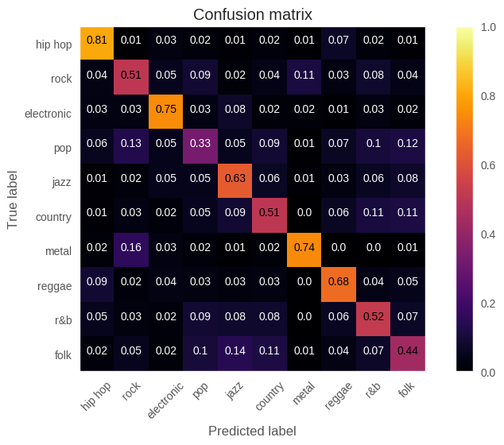
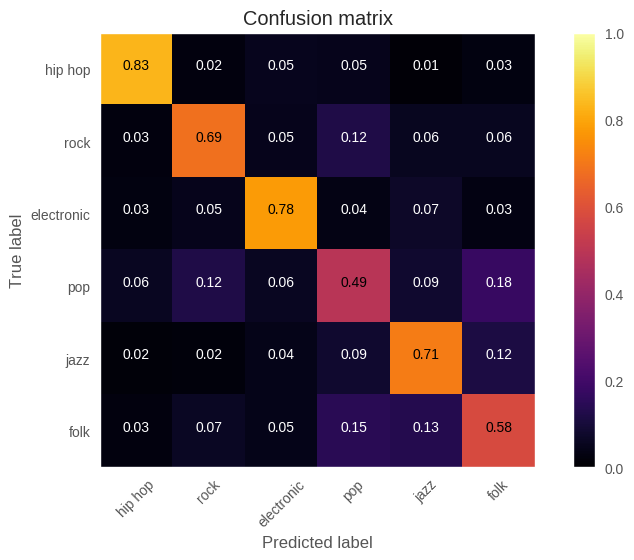

# Genre Recognition
The purpose of this experiment is to recognize music genre using machine learning techniques. We trained a support vector machine on about 50,000 samples. Each sample consisted of the song’s genre (the target), 90 features describing the song’s timbre, as well as the song’s length and speed (beats per minute). 

For more information, you can view this project’s [report](report.pdf).

## Results
 

This is a confusion matrix representing the performance of the SVM trained for 10 genres. We trained on 4,000 samples for each genre.

This is a confusion matrix representing the performance of the SVM trained for 6 genres. We trained on 10,000 samples for each genre.
